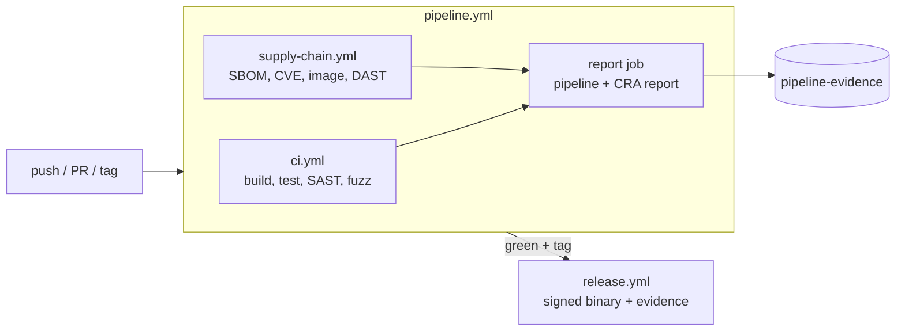

# Traction Telemetry Gateway

[](https://github.com/NexusHero/traction_telemetry_gateway/actions/workflows/pipeline.yml?query=branch%3Amain)
[](https://scorecard.dev/viewer/?uri=github.com/NexusHero/traction_telemetry_gateway)

**A reference pipeline for the EU Cyber Resilience Act (CRA, Regulation (EU)
2024/2847), built around a small C++20 service.** Every commit produces the
evidence a manufacturer needs for the CRA's technical documentation, checks it
against the regulation, and publishes the result.

The service itself is deliberately small: it receives binary telemetry frames
from a (fictional) rail-vehicle bus, validates them at one trust boundary, and
serves the latest values as JSON.

```
[telemetry producer] --POST /v1/frames (bearer token)--> [gateway] --> GET /v1/telemetry (JSON)
```

## CRA status

| Requirement | Status | Where it is shown |
| --- | --- | --- |
| Annex I Part I - security properties of the product (a)-(l) | ✅ met | pipeline evidence + [`docs/cra/risk-assessment.md`](docs/cra/risk-assessment.md) |
| Annex I Part I (m) - secure data removal | ➖ not applicable | the gateway stores nothing persistently |
| Annex I Part II - vulnerability handling (1)-(8) | ✅ met | SBOM, CVE scans, [`docs/cra/vulnerability-handling.md`](docs/cra/vulnerability-handling.md) |
| Art. 13(8) - support period | ✅ met | [`SECURITY.md`](SECURITY.md): 5 years per release, at least until 2031-12-31 |
| Art. 14 - reporting to ENISA / BSI (24 h / 72 h) | ✅ met | runbook in [`docs/cra/vulnerability-handling.md`](docs/cra/vulnerability-handling.md) |
| Annex II - information for the user | ✅ met | [`docs/cra/user-guidance.md`](docs/cra/user-guidance.md) |
| BSI TR-03183-2 - SBOM content | ✅ met | CycloneDX 1.5 SBOM with suppliers and SHA-512 hashes |

The status is not typed in: it is computed on every run from the evidence by
[`scripts/compliance_report.py`](scripts/compliance_report.py) against the
control catalogue [`compliance/controls.toml`](compliance/controls.toml), and a
failing check turns its control red. The report supports a conformity
assessment; it is not a certification.

## Where the evidence comes out

### 1. Every commit: the run summary

Open the latest [Pipeline run](https://github.com/NexusHero/traction_telemetry_gateway/actions/workflows/pipeline.yml?query=branch%3Amain)
and scroll to its summary. The final report shows every gate's verdict, the
key figures (tests, coverage, fuzzing, CVEs, DAST) and the CRA status.

### 2. Every commit: the `pipeline-evidence` artefact

Download it from the same run (kept 90 days). One directory, every file hashed
in the report's inventory:

| File | What it shows | CRA |
| --- | --- | --- |
| `pipeline-report.md` / `.json` | verdict of every gate, key figures | overview |
| `compliance-report.md` / `.json` | every control, its checks and evidence | all |
| `sbom.cdx.json` | CycloneDX 1.5 SBOM of the dependencies, BSI TR-03183-2 | Annex I Part II (1) |
| `image-sbom.cdx.json` | SBOM of the container image | Annex I Part II (1) |
| `conan-audit.json`, `grype-image.json` | known vulnerabilities in dependencies and image | Annex I Part I (2)(a) |
| `licenses.json`, `conan.lock` | licence verdicts, the exact dependency graph | Annex I Part II (1) |
| `ctest.txt`, `runs/*/ctest.txt` | tests on x86-64, macOS, AArch64, ASan, TSan | Annex I Part II (3) |
| `sast-gate.txt`, `clang-tidy.txt`, `cppcheck.txt` | static analysis against the reviewed baseline | Annex I Part II (3) |
| `fuzz-smoke.txt` | fuzzing statistics, crash reproducers if any | Annex I Part I (2)(h) |
| `zap-report.html` / `.json`, `schemathesis-junit.xml` | DAST and API contract tests of the running container | Annex I Part I (2)(h), (j) |
| `hardening.txt` | exploit mitigations read from the ELF | Annex I Part I (2)(k) |
| `coverage.txt` / `.xml` | line coverage (reported, not a target) | Annex I Part II (3) |

### 3. Every release: signed, permanent evidence

A `v*` tag creates a [GitHub Release](https://github.com/NexusHero/traction_telemetry_gateway/releases)
with the binary, an evidence bundle (SBOM, lockfile, CVE scan, licences, SAST,
tests built with the shipping toolchain, coverage, ELF hardening, compliance
report and a `MANIFEST.md`) and `SHA256SUMS`. Both carry SLSA build provenance; the image in GHCR is signed by
digest and carries its SBOM as an attestation (Annex I Part II (7)). Verify:

```sh
sha256sum -c SHA256SUMS
gh attestation verify ttg-<version>-linux-x86_64.tar.gz -R NexusHero/traction_telemetry_gateway
```

## Pipelines

| Workflow | Runs on | Purpose | CRA |
| --- | --- | --- | --- |
| [`pipeline.yml`](.github/workflows/pipeline.yml) | every push, PR, tag | one run per commit: calls the two below, then collects all evidence and writes the final report | all |
| ↳ [`ci.yml`](.github/workflows/ci.yml) | called | build and test (x86-64, macOS, AArch64/qemu), sanitizers, coverage, SAST, fuzz smoke, secrets scan, workflow audit, binary hardening | Part I (2)(k), Part II (3) |
| ↳ [`supply-chain.yml`](.github/workflows/supply-chain.yml) | called | SBOM, CVE and licence gates, container build and scans, DAST, signing | Part I (2)(a), (j), Part II (1), (7) |
| [`release.yml`](.github/workflows/release.yml) | tag `v*` | only from a green pipeline; builds once, signs, publishes binary + evidence | Part II (7), (8) |
| [`cve-rescan.yml`](.github/workflows/cve-rescan.yml) | nightly | rescans main and the latest release against today's advisories; opens an issue on findings | Part II (2) |
| [`fuzzing.yml`](.github/workflows/fuzzing.yml) | nightly | long libFuzzer run with a growing corpus | Part I (2)(h) |
| [`codeql.yml`](.github/workflows/codeql.yml), [`scorecard.yml`](.github/workflows/scorecard.yml) | push, PR, weekly | CodeQL, OpenSSF Scorecard (results in code scanning) | Part II (3) |
| [`benchmarks.yml`](.github/workflows/benchmarks.yml) | weekly | runtime and allocation benchmarks | - |



## Quick start

```sh
conan profile detect --force
conan install . --build=missing -of build -s build_type=Release
cmake -S . -B build -G Ninja -DCMAKE_BUILD_TYPE=Release \
      -DCMAKE_TOOLCHAIN_FILE=build/conan_toolchain.cmake
cmake --build build && ctest --test-dir build

# secure by default: no ingest token, no start
openssl rand -hex 32 > /tmp/ttg-token
TTG_INGEST_TOKEN_FILE=/tmp/ttg-token ./build/ttg_server
```

| Variable | Default | Meaning |
| --- | --- | --- |
| `TTG_INGEST_TOKEN_FILE` / `TTG_INGEST_TOKEN` | required | bearer token for `POST /v1/frames`, at least 32 characters |
| `TTG_ALLOW_UNAUTHENTICATED_INGEST` | unset | `1` disables ingest authentication - logged, not for production |
| `TTG_SECURITY_LOG` | `on` | security event log (JSON lines on stderr); `off` to opt out |
| `TTG_HOST` / `TTG_PORT` / `TTG_MAX_CHANNELS` | `0.0.0.0` / `8080` / `4096` | bind address, store bound |

Deploy it behind a TLS-terminating proxy - see the
[user guidance](docs/cra/user-guidance.md).

## Documentation

| Document | Content |
| --- | --- |
| [`docs/cra/`](docs/cra/) | risk assessment, user guidance, vulnerability handling and Art. 14 reporting |
| [`SECURITY.md`](SECURITY.md) | reporting a vulnerability, support period, remediation targets, gate thresholds |
| [`docs/threat-model.md`](docs/threat-model.md) | STRIDE model of the trust boundaries |
| [`docs/development.md`](docs/development.md) | building, local tools (sanitizers, fuzzing, SBOM, DAST, ...), HTTP API, wire format, pipeline hardening |
| [`docs/realtime.md`](docs/realtime.md) | real-time and target-platform scope: what CI shows and what needs hardware |
| [`docs/openapi.yaml`](docs/openapi.yaml) | the HTTP API contract |
